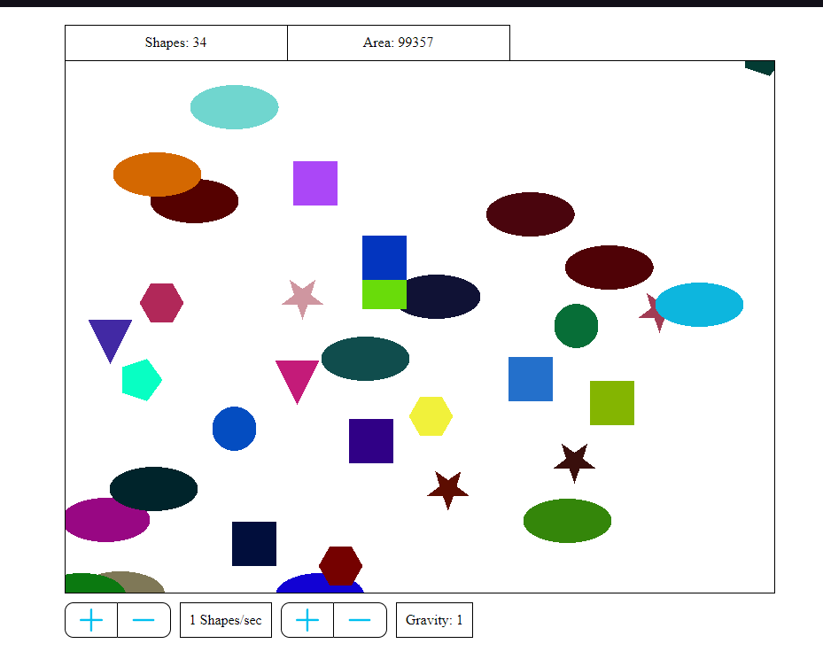

# Falling shapes test task Documentation

## Getting Started

First, install all of the dependencies: `npm install`.

Then run the command `npm run dev` to start the development server. Open [http://localhost:5173](http://localhost:5173) with your browser to see the result. Development server will auto-update as you edit the files.

Screenshot of application:

